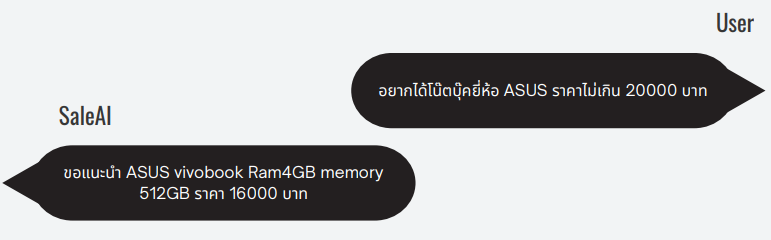
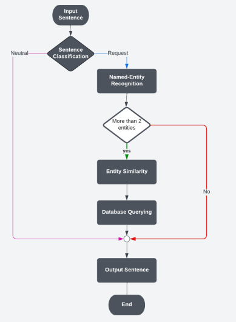
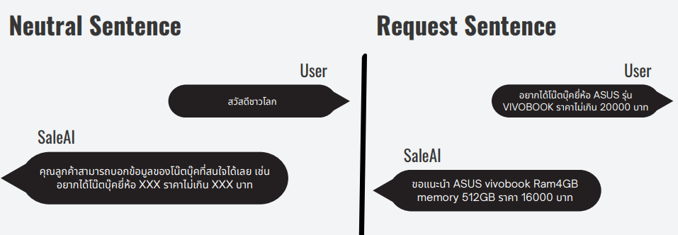
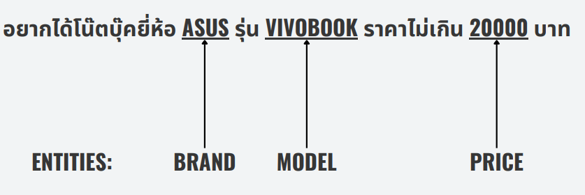
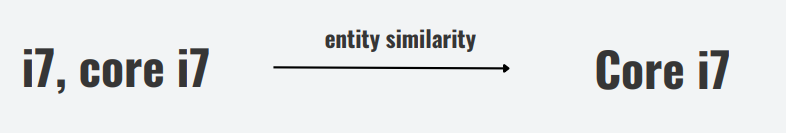
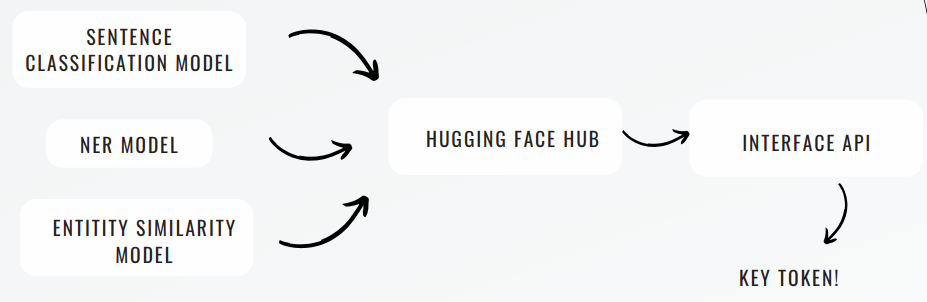
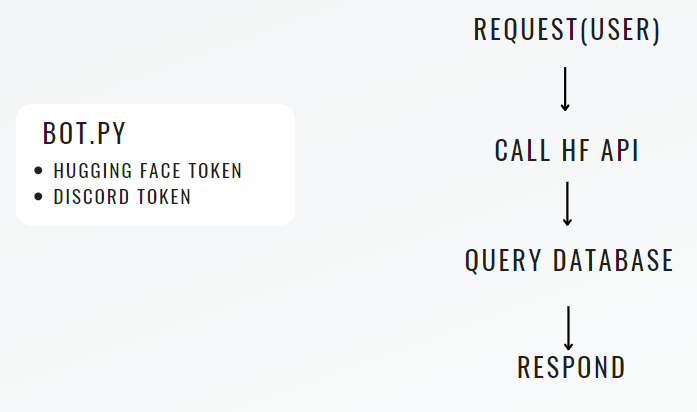

# Chatbot for Recommendation System in Laptop Store
The purpose of this project is to develop a Chatbot designed to provide information about laptops. The Chatbot is implemented on the Discord platform,
the Chatbot integrates several NLP models, including sentence classification, named entity recognition, and named entity similarity. These models are 
deployed and accessed via the Hugging Face API.Users can interact with the Chatbot to request laptop recommendations by providing information such as
Brand, CPU specifications, price range, and other relevant details.

  

# System Workflow
The system workflow starts with receiving input messages, followed by 
entering the sentence classification process. The purpose of this process is to classify the input 
as either a request or neutral. In the case of a neutral classification, the system will reply with 
"unknown, unknown, unknown." However, if the input is classified as a request, it will undergo 
token classification to extract entities. There is a possibility that some entities may not be 
found during this extraction process. After acquiring the entities, they will go through the zero-
5
shot classification process to determine their respective classes. These classes include brand, 
model, processor_brand, processor_name, RAM, memory, and price. The acquired entities will 
be mapped to the classes that are closest to them. Subsequently, these classes will be used to 
query the database and retrieve the requested information for the user, sorting it accordingly.

  

### Sentence classification Ex.

  

### Name-Entity Recognition Ex.

  

### Entity Similarity Ex.

  

### Model Deployment
The model was deployed to the Hugging Face Hub, a platform facilitating convenient access and sharing of NLP models and resources.
Furthermore, we've incorporated the Hugging Face API, acting as the bridge between Discord and the deployed models. This integration
ensures seamless communication and interaction between the Chatbot and users on the Discord platform.

  

### Chatbot Implementation
For the implementation of the Chatbot, we chose Discord Chat as our communication platform. This decision was based on the functionalities
offered by the Discord Developer Console, which align well with the project requirements. Discord provides various features,
including real-time messaging, which are ideal for our Chatbot implementation.

Additionally, we integrated a database querying component to facilitate the retrieval of laptop information based on entities extracted from
input sentences in previous stages. This enables the Chatbot to deliver accurate and relevant laptop information to users.

By combining these components, we developed a Chatbot capable of functioning in real-world scenarios by providing laptop information to users. 
The implementation integrates Discord as the communication platform, deploys NLP models and tokenizers to the Hugging Face Hub, and incorporates
a database querying mechanism to retrieve laptop data based on user inputs.

  

## Files in this project
- [SaleAI_Presentation.pdf](SaleAI_Presentation.pdf) ->  Presentation file to describe about project overview, methodologies, model experiment, conclusion
- [BERT_SentenceClassification.ipynb](BERT_SentenceClassification.ipynb) -> Notebook file for develop and experiment about Sentence classification model with BERT.
- [LSTM_SentenceClassification.ipynb](LSTM_SentenceClassification.ipynb) -> Notebook file for develop and experiment about Sentence classification model with LSTM.
- [NameEntityRecognition_and_EntitySimilarity.ipynb](NameEntityRecognition_and_EntitySimilarity.ipynb) -> Notebook file for develop and experiment about NameEntity Recognition and Entity Similarity.
- [Discord_Bot/main.py](Discord_Bot/main.py) ->  Python script for implement chatbot with discord.
- [Discord_Bot/laptop_database.csv](Discord_Bot/laptop_database.csv) -> Demo database of laptop in store.

